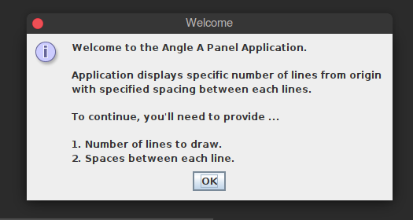
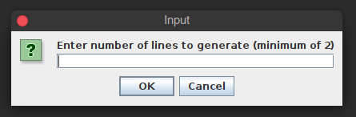
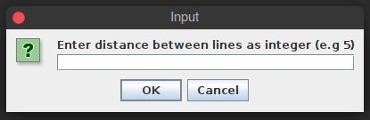
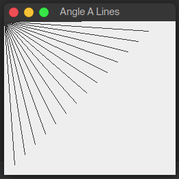

## ANGLE "A" LINE APP 

Java application designed using the Swing API, displaying lines protruding from the
origin (0,0) coordinate axes in a ``` Jpanel ```. User specifies number of lines to display and the distance
between each line. Application proceeds to display a ```  JPanel ```, with lines originating from ``` (0,0) ```
and ending at specific points in the panel based on the specified distance between lines.


### Application User Interface Configuration

Application is based on the [Swing](https://docs.oracle.com/javase/7/docs/api/javax/swing/package-summary.html) API
in Java, for building user interface. The look and feel of the application is based on the system running the application. 

### Running Application Images

A first successful run of application shows this view. Specifying what the application is all about, what is needed from user
and what to expect after user provides all necessary information. 



Requesting the number of lines to generate. Minimum of 2 lines required to have something to display on the 
``` JPanel```. 




Specify the distance between two lines. The larger the number, the more separated the lines will be from
each other.




The image below depicts view after specifying the *number of lines to generate* value, and the **distance between lines** value. 
Here, for number of lines to generate, the value is ```15``` and for the spacing between lines 
the value is ```15```. The resulting image is as shown below




#### BUILD WITH

1. [IntelliJ](https://www.jetbrains.com/idea/) JetBrains (IDE) 
2. Ubuntu 18.04 LTS