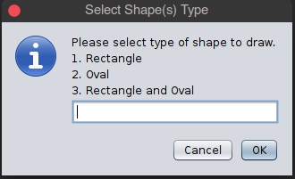
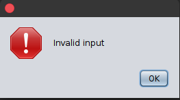
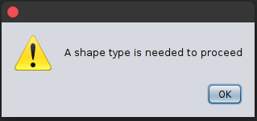
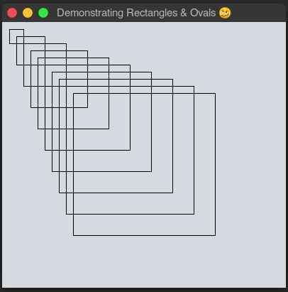
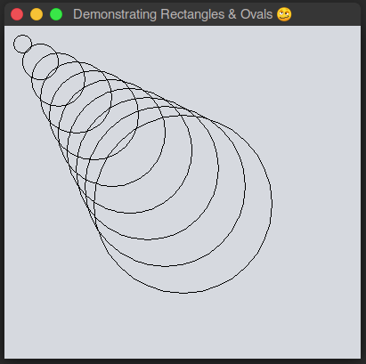
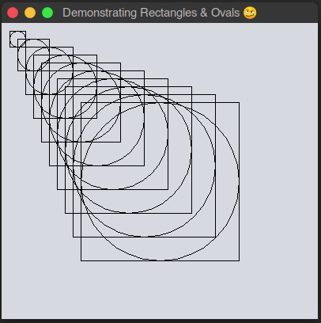

### Java Swing Apps - Rectangles & Ovals

Using the Java [Swing API](https://docs.oracle.com/javase/7/docs/api/javax/swing/package-summary.html) to build an 
application that demonstrates various UI structures with Swing [Rectangle API](https://docs.oracle.com/javase/7/docs/api/java/awt/class-use/Rectangle.html) 
and the [Oval API](http://www.java2s.com/Code/JavaAPI/java.awt/GraphicsdrawOvalintxintyintwidthintheight.htm). All these 
APIs are part of the Java SE [Graphics API](https://docs.oracle.com/javase/7/docs/api/java/awt/Graphics.html). 

#### APP VIEWS

###### BEFORE SHAPE SELECTION

| App Run                              | Second View (Bad Input)               | Second View (Warning - no input)      
|:-------------------------------------|:-------------------------------------:|:-------------------------------------:|
|   |  |  |  

###### AFTER SHAPE SELECTION

| Rectangles View                      | Ovals View                    | Rectangle And Oval Combined                                     
|:------------------------------------:|:-----------------------------:|:--------------------------------------------------:|
|    |  |      |   

[comment]: <> (| Column #1  | Column #2   | Center align |)

[comment]: <> (|:-----------|------------:|:------------:|)

[comment]: <> (| will       |        will |     will     |)

[comment]: <> (| be         |          be |      be      |)

[comment]: <> (| left       |       right |    center    |)

[comment]: <> (| aligned    |     aligned |    aligned   |)

[comment]: <> (| Left align | Right align | Center align |)

[comment]: <> (|:-----------|------------:|:------------:|)

[comment]: <> (| This       |        This |     This     |)

[comment]: <> (| column     |      column |    column    |)

[comment]: <> (| will       |        will |     will     |)

[comment]: <> (| be         |          be |      be      |)

[comment]: <> (| left       |       right |    center    |)

[comment]: <> (| aligned    |     aligned |    aligned   |)
